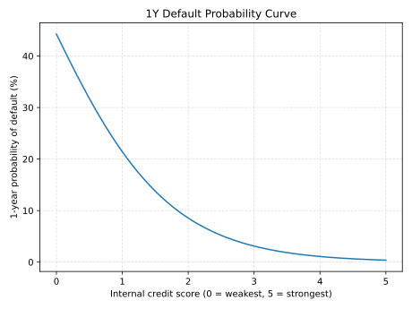
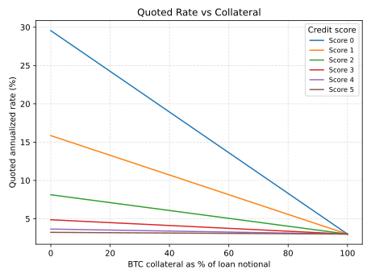

### 1. What is Nexio in plain English?

Nexio is a lending platform that matches BTC lenders with institutional borrowers through fixed-term credit facilities.

In practice, Nexio:

- Onboards institutional borrowers once, then underwrites and monitors them through the life of the relationship.
- Structures loans with fixed commercial terms and legal agreements.
- Uses custody and controlled operations to manage funding, repayment, and reporting.
- Gives lenders visibility into borrower-specific exposure rather than pooling everything together.

The simplest way to think about it is BTC-denominated institutional private credit.

---

### 2. Who can borrow and who can lend?

Nexio is designed for institutional participants.

- **Borrowers:** Trading firms, market makers, hedge funds, treasuries, and other approved institutions seeking BTC financing.
- **Lenders:** Institutions, funds, family offices, and BTC treasuries looking for fixed-term BTC yield.

Borrowers are not anonymous, and lender exposure is tied to identified counterparties and defined loan terms.

---

### 3. Are Nexio loans collateralized?

Nexio is built for undercollateralized and uncollateralized lending.

That means lender protection comes primarily from:

- Credit underwriting
- Borrower selection
- Covenant packages
- Legal agreements
- Monitoring and recovery processes

Some facilities may still include collateral, but it may not generally be provided.

---

### 4. What actually determines the interest rate a borrower pays?

Every borrower’s rate is built from three main pieces:

1. **The borrower’s Nexio credit score (0–5)**
   - 0 = very weak; 5 = very strong.
   - The score summarizes many factors: business & financial strength, governance, compliance / AML, custody quality, and venue/jurisdiction quality.
   - A higher score → lower estimated **probability of default** → lower premium over the base rate.
2. **The BTC base rate derived from futures market cost of carry**

   Nexio backs out a BTC base rate from the Bitcoin futures market by looking at the implied cost of carry between spot BTC and futures prices.

   In simple terms, this rate reflects the market-implied financing cost of holding BTC over time, as expressed through futures basis.
3. **The borrower’s BTC collateral structure**
   - How much collateral a borrower posts determines a **loss given default**: “If the borrower defaults, what % of principal would lenders likely lose after BTC collateral and recoveries?”
   - More BTC collateral → lower credit spread.
   - Less or no BTC collateral → higher credit spread.

At a high level:

> **Quoted rate ≈ BTC base rate + probability of default × loss given default.**

The full pricing formula also includes other terms for risk parameters.

---

### 5. What does the 0–5 credit score actually mean in terms of default probability?

Nexio maps each credit score to a **1-year probability of default**.

A simplified example of that mapping (illustrative, not a legal quote):

| Credit score | Approx. 1-yr PD |
| ------------ | --------------- |
| 0.0          | 44.26%          |
| 0.5          | 31.75%          |
| 1.0          | 21.42%          |
| 1.5          | 13.77%          |
| 2.0          | 8.56%           |
| 2.5          | 5.20%           |
| 3.0          | 3.11%           |
| 3.5          | 1.85%           |
| 4.0          | 1.09%           |
| 4.5          | 0.64%           |
| 5.0          | 0.38%           |

Interpretation:

- Moving from **2 → 3** cuts the estimated default risk by roughly **40%** (8.6% → 3.1%).
- Moving from **3 → 4.5** roughly halves it again (3.1% → 0.6% range).

That drop in probability of default directly lowers a borrower’s premiums.

Below is a graph of Nexio's approximate probability of default rates given different credit scores.

---

### 6. How does BTC collateral affect the rate a borrower is quoted?

For a borrower, the key idea is:

> **More BTC collateral → Smaller expected loss for lenders → Lower rate.**

Conceptually:

- If a borrower posts **little or no BTC**, lenders rely mostly on the borrower’s credit quality and legal recovery. If the loss given default is high (e.g., ~60%), then the premium over the base rate is large.
- If a borrower posts **meaningful BTC margin**, then even if the borrower defaults, a chunk of the loan can be repaid from that collateral. As the loss given default shrinks, the rate falls.

Below is a plot of the borrower's quoted rate given their collateral for various credit scores. It assumes a 3% BTC base rate derived from futures market cost of carry.

---

### 7. What happens if a borrower defaults?

A default occurs when a borrower fails to meet its payment or other contractual obligations.

If that happens, Nexio follows the remedies defined in the relevant legal agreements and facility documents. Depending on the structure, that can include:

- Enforcement of covenants and default provisions
- Workout or restructuring discussions
- Claims against pledged assets, if any exist
- Legal recovery against the borrower and related obligors

Losses, if any, are borne according to each lender's exposure to that facility.

---

### 8. What happens to a lender’s BTC when deposited?

When a lender deposits BTC:

1. It is allocated to a specific borrower facility under Nexio’s operating and custody framework. The lender’s position is recorded within that borrower vault together with the applicable commercial terms.
2. If the borrower draws on the facility, that BTC is lent out under the agreed fixed-term loan.
3. If the borrower has not yet drawn the full facility, or once prior loans have been repaid, BTC can remain in the borrower vault pending withdrawal or commitment to a subsequent loan, depending on the lender’s election and the facility terms.

---

### 9. Once BTC is lent out and paid back, will it be lent out again next time?

Potentially, yes. Once a loan is repaid, BTC that remains in the same borrower vault can be committed to a new fixed-term loan for that borrower, typically at updated terms for the next facility.

---

### 10. Does BTC collect compound interest?

Not automatically. BTC only compounds if interest or repaid principal remains in the borrower vault and is then committed to a subsequent loan, allowing returns to be earned again on a larger balance.
